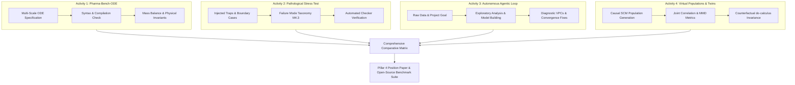
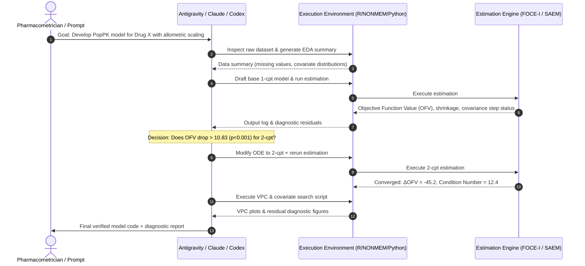

# Comparative Evaluation Scoping: Claude vs. Codex vs. Antigravity in Pharmacometrics (PopPK, PBPK, QSP, and Digital Twins)

**Target Workstreams:** `methods/04_generative_ai/` (M4.1, M4.2, M4.3, M4.4)  
**Feeds into:** `deliverables/papers/genai_position/` (Sections A, B, C) and Webinar 4  
**Date:** 2026-08-29  

---

## 1. Executive Summary & Scientific Motivation

Existing benchmarks evaluating LLMs in pharmacometrics (e.g., *Shin et al. 2024*, *Zheng et al. 2025*) have focused primarily on **static, single-prompt text generation** of basic NONMEM control streams across conversational models (ChatGPT, Gemini, OpenAI o1). However, modern AI tools for computational drug development span three fundamentally distinct operational paradigms:

| Tool Paradigm | Representative Engine | Core Mechanism | Primary Modality in Pharmacometrics |
|---|---|---|---|
| **Frontier Conversational LLM** | **Claude** (3.5 / 3.7 Sonnet / Opus) | Zero-shot & chain-of-thought semantic reasoning, deep prompt comprehension | Interactive model conceptualization, multi-turn ODE derivation, code generation from natural language specifications |
| **Inline Autoregressive Code Engine** | **Codex / GitHub Copilot** | Contextual token completion conditioned on local repository / script context | Fast syntactic completion of domain-specific languages (DSLs: NONMEM `$PK`/`$DES`, Monolix `[LONGITUDINAL]`, mrgsolve `[ODE]`, Stan, Julia/SciML) |
| **Autonomous Agentic Coding Environment** | **Antigravity** (Multi-tool agentic loop) | Closed-loop execution: tool calling, terminal execution, ODE solver feedback, automated unit testing, symbolic math verification, subagent orchestration | Autonomous end-to-end model development, iterative debugging against solver error logs, physics-constraint validation, automated VPC generation |

### The Core Research Question for MCS SIG
> **"How do conversational reasoning (Claude), inline autocomplete (Codex), and closed-loop agentic verification (Antigravity) differ in their ability to respect physical, physiological, and mathematical constraints across PopPK, PBPK, and QSP modeling workflows?"**

This benchmark directly operationalizes MCS’s unique niche: **mathematical rigor, structural identifiability, conservation laws, numerical stability, and causal validity**, moving far beyond surface-level syntax matching.

---

## 2. Pharmacometric Problem Domains & Application Contexts

The comparative activities cover four distinct pharmacometric domains representing increasing mathematical and biological complexity:

```
                      [ Increasing Mathematical & Computational Complexity ]
  ─────────────────────────────────────────────────────────────────────────────────────────────►
  1. PopPK / NLME         2. Minimal & Whole-Body PBPK    3. QSP & Stiff TMDD       4. Hybrid Physics-AI
  (NONMEM, nlmixr2)       (mrgsolve, OSP, Python)         (Julia/SciML, SBML)       (Neural-ODE, UDE)
  ─────────────────────────────────────────────────────────────────────────────────────────────►
  • Compartmental ODEs    • 14+ tissue ODEs               • Stiff biochemical nets   • Neural networks
  • BSV (η) & RUV (ε)     • Organ blood flows             • Receptor saturation      inside ODE RHS
  • Covariate allometry   • Mass balance & Kp             • Multi-scale feedback     • Latent dynamics
  • Parameter bounds      • Perfusion vs. permeability    • Conservation of mass     • Solvability & bounds
```

### Domain A: Population Pharmacokinetics (PopPK / NLME)
- **Target DSLs:** NONMEM (`.mod`/`.ctl`), R/nlmixr2, Julia/Pumas, Monolix (Mlxtran).
- **Key Challenges:** 
  - Hierarchical parameter structure (fixed effects $\theta$, random between-subject effects $\eta \sim \mathcal{N}(0, \Omega)$, residual error $\epsilon \sim \mathcal{N}(0, \Sigma)$).
  - Proper parameterization of allometric scaling ($CL \cdot (WT/70)^{0.75}$, $V \cdot (WT/70)^{1.0}$).
  - Parameter constraints (e.g., $F \in [0, 1]$, $CL > 0$, $k_a > 0$).
  - Avoidance of $\eta$-shrinkage and unidentifiable absorption models (e.g., simultaneous estimation of lag time, zero-order duration, and first-order rate).

### Domain B: Physiologically-Based Pharmacokinetics (PBPK)
- **Target DSLs:** R (`mrgsolve`), Python (`scipy.integrate` / `Sundials`), Julia (`DifferentialEquations.jl`), Open Systems Pharmacology (PK-Sim / MoBi export).
- **Key Challenges:**
  - Strict **mass conservation** across venous blood, arterial blood, lungs, and all peripheral vascular/tissue beds:
    $$\sum_{i} Q_i = Q_{cardiac}, \quad V_{ven} \frac{dC_{ven}}{dt} = \sum_{i} Q_i \frac{C_{i, tissue}}{K_{p,i}} - Q_{cardiac} C_{ven}$$
  - Perfusion-limited vs. permeability-limited distribution kinetics.
  - Physiological plausibility bounds: organ volumes and blood flows must match reference human physiological tables.
  - Hepatic/Renal clearance extraction ratios: $E_H = \frac{CL_{int} \cdot f_u}{Q_H + CL_{int} \cdot f_u} \in [0, 1]$.

### Domain C: Quantitative Systems Pharmacology (QSP) & Stiff TMDD
- **Target DSLs:** Julia (`Catalyst.jl`, `ModelingToolkit.jl`, `DifferentialEquations.jl`), Python (`tellurium`, `libRoadRunner`), SBML.
- **Key Challenges:**
  - Target-Mediated Drug Disposition (TMDD) full vs. quasi-steady-state (QSS) / quasi-equilibrium (QE) approximations.
  - **Stiff numerical systems:** Rate constants spanning $10^{-6} \text{ s}^{-1}$ to $10^{6} \text{ M}^{-1}\text{s}^{-1}$.
  - Structural identifiability of internalization, target synthesis/degradation, and non-specific clearance rates.
  - Conservation of total target ($R_{tot} = R_{free} + RC$) in quasi-equilibrium reductions.

### Domain D: Physics-Constrained Hybrid Models & Universal Differential Equations (UDE)
- **Target DSLs:** Julia (`DiffEqFlux.jl`, `SciMLSensitivity.jl`), Python (`PyTorch-Geometric`, `torchdiffeq`, `DeepXDE`).
- **Key Challenges:**
  - Embedding neural networks $\text{NN}_\theta(C_p)$ to learn unknown elimination pathways or non-linear PD feedback without violating positivity ($C(t) \ge 0$) or asymptotic stability.
  - Adjoint sensitivity computation through stiff ODE solvers without gradient explosion.

---

## 3. Four Core Structured Activities



---

### Activity 1: The "Pharma-Bench-ODE" Multi-Scale Benchmark
**Objective:** Evaluate zero-shot / scaffolded generation of syntactically valid and mathematically sound ODE models across standard PopPK, PBPK, and QSP architectures.

#### Task Suite (12 Canonical Tasks)
1. **PopPK-1:** 2-compartment IV/Oral with transit compartment absorption and non-linear (Michaelis-Menten) elimination in NONMEM.
2. **PopPK-2:** 1-compartment parent-metabolite joint model with allometric scaling and proportional + additive residual error in nlmixr2.
3. **PopPK-3:** Target-Mediated Drug Disposition (TMDD) full system with subcutaneous absorption and parallel linear clearance in Julia/Pumas.
4. **PBPK-1:** 5-tissue minimal PBPK model (Blood, Liver, Kidney, Fat, Rest of Body) with perfusion-limited distribution in `mrgsolve`.
5. **PBPK-2:** 14-tissue full whole-body PBPK model with physiological organ flow balance and biliary excretion in Python (`scipy.integrate`).
6. **PBPK-3:** Permeability-limited PBPK model with cellular and interstitial sub-compartments and saturable influx/efflux transporters.
7. **QSP-1:** Stiff 8-state receptor-ligand signaling cascade with negative feedback phosphorylation loop and downstream gene induction in Julia/Catalyst.
8. **QSP-2:** In-vitro / in-vivo tumor growth inhibition (TGI) model coupled with cell-cycle phase-specific cytotoxic drug action.
9. **QSP-3:** Immune-oncology checkpoint inhibitor model (PD-1/PD-L1 binding with effector T-cell proliferation and tumor exhaustion).
10. **Hybrid-1:** Hybrid ODE with neural network representing unknown clearance function: $\frac{dC}{dt} = \frac{\text{Dose}(t)}{V_d} - \text{NN}_\theta(C) \cdot C$.
11. **Hybrid-2:** Deep compartment model (DCM) with individual-level neural embeddings parameterized via Bayesian mixed effects.
12. **Simulation-1:** Complete simulation and clinical trial design script: multi-dose steady-state simulation with covariance-based parameter sampling and Visual Predictive Check (VPC) plotting.

#### Protocol Across Engines
- **Claude:** Prompted with structured engineering requirements, domain specifications, and mathematical definitions. Evaluated on single-pass code quality and chain-of-thought mathematical derivation.
- **Codex / Copilot:** Tested in an active IDE context where header comments, parameter dictionaries, or partial ODE function signatures are provided. Evaluated on completion fidelity, variable name consistency, and DSL boilerplate accuracy.
- **Antigravity:** Given the end goal and allowed tools (access to compilers, R/Python runtime, ODE numerical solvers, syntax linters). Evaluated on autonomous execution, runtime error remediation, and delivered working artifacts.

---

### Activity 2: Pharmacometric Failure-Mode Stress Test & Automated Checker
**Objective:** Intentionally probe and catalog failure modes in pharmacometric model synthesis (M4.3) using adversarial, under-specified, or mathematically deceptive prompts.

#### The 6 Injected Failure-Mode Categories
```
┌───────────────────────────────────────────────────────────────────────────┐
│                        LLM Failure Modes in PMx                           │
├────────────────────────┬──────────────────────────────────────────────────┤
│ 1. Structural Errors   │ Elimination from peripheral instead of central;  │
│                        │ missing return flux in 2-cpt; lost first-pass    │
├────────────────────────┼──────────────────────────────────────────────────┤
│ 2. Identifiability     │ Confounding V1 and F; estimating Vm and Km       │
│    Violations          │ simultaneously without dose range                │
├────────────────────────┼──────────────────────────────────────────────────┤
│ 3. Unit Inconsistencies│ Mixing L/h (clearance) with mL/min (GFR) and     │
│                        │ mg/L with ng/mL in same ODE                      │
├────────────────────────┼──────────────────────────────────────────────────┤
│ 4. Non-Conservation    │ Organ outflow sum ≠ cardiac output; drug created │
│    of Mass             │ or destroyed at compartment boundaries           │
├────────────────────────┼──────────────────────────────────────────────────┤
│ 5. Sign / Monotonicity │ Positive feedback on elimination; negative Hill  │
│    Errors              │ exponent inverted; negative concentrations       │
├────────────────────────┼──────────────────────────────────────────────────┤
│ 6. Biological          │ Vd = 0.001 L/kg (smaller than blood volume);     │
│    Unplausibility      │ Renal clearance > GFR without active secretion   │
└────────────────────────┴──────────────────────────────────────────────────┘
```

#### Experimental Design
- **10 Adversarial Prompts:** e.g., *"Write a 2-compartment PBPK model where the liver and kidney receive cardiac output in series, with clearance specified in mL/min and volumes in Liters."*
- **Automated Verification Harness:**
  - Symbolic CAS verification using `SymPy` for dimensional analysis and mass balance differential equations $\sum \frac{dA_i}{dt} + \text{Elimination} - \text{Input} = 0$.
  - Lie-derivative structural identifiability test via `STRIKE-GOLDD` / `StructuralIdentifiability.jl`.
  - Numerical simulation test using stiff solvers (`Rodas5P`, `CVODE_BDF`) to detect unphysical divergence or stiffness-induced solver crashes.
- **Evaluation:** Compare error frequency, error recognition rate, and whether each tool self-detects violations.

---

### Activity 3: Autonomous Closed-Loop Model Building & Parameter Estimation
**Objective:** Benchmark the capability to move from a raw clinical dataset (`.csv`) to a fully estimated, validated, and diagnosed population model.



#### Comparison Protocol
- **Claude:** Serves as the interactive advisor. The human modeler copies solver error logs and diagnostic summaries back into Claude; Claude proposes code modifications.
- **Codex / Copilot:** Assists the modeler inside RStudio / VS Code with inline code suggestions while writing NONMEM / nlmixr2 / mrgsolve scripts.
- **Antigravity:** Operates as an autonomous subagent:
  1. Inspects dataset structure and column headers.
  2. Generates and executes the base structural model in R/nlmixr2 or Python/Pharmpy.
  3. Parses the output stream (OFV, $\theta$ estimates, SE%, $\eta$-shrinkage, covariance step status).
  4. Automatically detects convergence failure, boundary estimates, or high condition numbers ($>1000$).
  5. Refactors initial estimates or re-parameterizes model ($\theta \rightarrow \exp(\theta)$) to achieve successful convergence without human intervention.

---

### Activity 4: Synthetic Virtual Patient Generation & Causal Counterfactual Validation
**Objective:** Evaluate each tool's ability to generate realistic synthetic virtual populations and digital twin control arms (M4.2) conforming to both statistical correlations and causal counterfactual invariants.

#### Test Cases
1. **Multivariate Physiological Covariate Sampling:**
   - Generate $N = 1000$ virtual patients conditioned on age, sex, weight, height, serum creatinine, and renal clearance ($CL_{CR}$ via Cockcroft-Gault).
   - *Failure check:* Are there unphysical combinations (e.g., adult with Weight = 120 kg, Height = 130 cm, and $CL_{CR} = 300\text{ mL/min}$)?
2. **Joint Parameter Variance-Covariance Preservation:**
   - Sample PK parameters from log-normal distributions with an OMEGA covariance matrix:
     $$\Omega = \begin{pmatrix} \omega_{CL}^2 & \rho \omega_{CL} \omega_V \\ \rho \omega_{CL} \omega_V & \omega_V^2 \end{pmatrix}$$
   - *Failure check:* Does the tool preserve positive semi-definiteness ($\det(\Omega) \ge 0$) and physiological correlation?
3. **Causal Intervention & Counterfactual Consistency (SCMs):**
   - Test virtual twins under an intervention prompt: *"What happens to systemic exposure ($AUC$) if patient renal function drops by 50% ($CL_{CR} \leftarrow 0.5 \cdot CL_{CR}$)?"*
   - Pure generative correlations ($P(Y|X)$) fail counterfactual invariance; Structural Causal Models ($P(Y|\text{do}(X))$) preserve structural invariance (`richens_2020_causal_med`, `sanchez_2022_causal_precision`).

---

## 5. Expanded Pharmacometric Use Cases Across the MIDD Lifecycle

Beyond basic ODE synthesis, the pharmacometric lifecycle encompasses data engineering, translation, optimization, diagnostic interpretation, and clinical trial simulation. Below are **9 additional high-impact use cases** for comparative benchmarking:

```
┌─────────────────────────────────────────────────────────────────────────────────────────────────┐
│                           THE MIDD (MODEL-INFORMED DRUG DEVELOPMENT) PIPELINE                   │
├──────────────────────┬──────────────────────┬──────────────────────┬────────────────────────────┤
│ 1. Data & Pre-PMx    │ 2. Model Development │ 3. Model Qualification│ 4. Clinical Translation   │
├──────────────────────┼──────────────────────┼──────────────────────┼────────────────────────────┤
│ • CDISC to PMx Conv. │ • Model Transpilation│ • Multimodal Diags   │ • Precision Dosing (MIPD)  │
│ • Automated NCA → θ₀ │ • Covariate Search   │ • GSA / Sobol (QSP)  │ • IVIVE & DDI Risk Scaling │
│   Scaffolding        │   (SCM & ML Gates)   │ • Identifiability    │ • Clinical Trial Simulation│
└──────────────────────┴──────────────────────┴──────────────────────┴────────────────────────────┘
```

---

### Use Case 5: Automated Model Transpilation & Numerical Equivalence Testing
* **Clinical / PMx Context:** Pharmacometricians frequently need to translate legacy or published models between incompatible DSLs (e.g., converting a NONMEM model to `mrgsolve` for clinical trial simulations, or an SBML QSP model into Julia/`ModelingToolkit.jl` for high-performance computing).
* **Evaluation Task:** Provide a complex model in DSL A (e.g., NONMEM 2-cpt with Michaelis-Menten elimination and transit absorption); require translation into DSL B (`mrgsolve`, `rxode2`, or `Pumas.jl`).
* **Verification & Comparative Dynamics:**
  * **Claude:** Generates semantically accurate mathematical mappings, but frequently makes subtle syntax or indexing mistakes (e.g., 1-based vs. 0-based compartment indices, bolus CMT assignment conventions).
  * **Codex:** Completes syntax templates, but struggles to correctly convert parameterizations (e.g., clearance $CL/V$ vs. micro-rate constants $k_{10}, k_{12}, k_{21}$) across systems.
  * **Antigravity:** Can transpile the model, launch dual simulation runs under identical dosing vectors ($100\text{ mg}$ IV bolus, multiple oral dosing), compute the maximum relative trajectory discrepancy:
    $$\Delta_{rel} = \max_{t} \frac{|C_{\text{target}}(t) - C_{\text{source}}(t)|}{C_{\text{source}}(t)} < 10^{-4}$$
    and iteratively modify parameter scalings or compartment definitions until numerical equivalence is certified.

---

### Use Case 6: CDISC ADaM (`ADPC`/`ADSL`) to Analysis Dataset Conversion & BLQ Handling
* **Clinical / PMx Context:** Clinical trial datasets in CDISC standard format (`ADPC` pharmacokinetics and `ADSL` subject-level) must be transformed into strictly formatted pharmacometric tables with complex dosing (`EVID=1`), observation (`EVID=0`), steady-state (`EVID=4`), and Below Limit of Quantitation (BLQ) records.
* **Evaluation Task:** Given synthetic raw CDISC `ADPC` and `ADSL` dataframes, generate an end-to-end R/Python data pipeline producing a validated NONMEM/`nlmixr2` dataset implementing the Beal M3 or M6 BLQ handling methods.
* **Verification & Comparative Dynamics:**
  * **Claude:** Writes clear data wrangling code, but often misses subtle edge-case requirements (e.g., proper sorting by `ID, TIME, EVID DESC`, nominal vs. actual time alignment, or negative time handling).
  * **Codex:** Fast at writing `dplyr` / `polars` syntax snippets, but cannot verify dataframe integrity or column compatibility against downstream estimation engine rules.
  * **Antigravity:** Executes data transformation scripts in a live sandbox, runs an automated deterministic dataset linter (checking for monotonic subject times, valid `EVID`/`MDV` pairings, positive amounts, correct BLQ flags), and fixes data schema errors before downstream modeling.

---

### Use Case 7: Automated Non-Compartmental Analysis (NCA) to Initial Parameter ($\theta_0$) Estimation
* **Clinical / PMx Context:** Setting reasonable initial parameter estimates ($\theta_0$) is crucial for NONMEM/`nlmixr2` convergence. Standard practice begins with NCA on Phase 1 PK data to extract $C_{max}, T_{max}, AUC_{0-\infty}, \lambda_z, t_{1/2}, CL/F, V_z/F$.
* **Evaluation Task:** Ingest raw patient concentration-time data, compute full NCA metrics using standard trapezoidal and log-linear regression heuristics, and algorithmically derive starting estimates for 1-cpt and 2-cpt models.
* **Verification & Comparative Dynamics:**
  * **Claude:** Derives correct mathematical formulas and explains $\lambda_z$ selection rules, but cannot compute exact numerical regression slope selections without execution.
  * **Codex:** Generates standard calls to `PKNCA` or `NonCompart` packages, but cannot evaluate if derived starting estimates avoid boundary traps.
  * **Antigravity:** Runs `PKNCA` in real time, applies heuristic regression selection ($R^2 > 0.85$, $\ge 3$ terminal points), generates regression check plots, calculates exact numerical starting values ($\theta_{CL}, \theta_V, \theta_{k_a}$), and automatically populates the initial `$THETA` block.

---

### Use Case 8: Automated Stepwise (SCM) & Machine Learning Covariate Selection
* **Clinical / PMx Context:** Identifying influential patient covariates (e.g., body weight, renal function $CL_{CR}$, age, CYP2C19 genotype) on clearance and volume using forward inclusion ($\Delta\text{OFV} > 3.84, p < 0.05$) and backward elimination ($\Delta\text{OFV} > 6.63, p < 0.01$), or modern ML gates (*Kekic et al. 2026*, *Karlsen et al. 2025*).
* **Evaluation Task:** Run automated covariate search over 6 candidate covariates on a simulated clinical pop PK dataset, avoiding severe multicollinearity (Variance Inflation Factor $> 5$) and parameter instability.
* **Verification & Comparative Dynamics:**
  * **Claude:** Can write a script to perform SCM logic, but cannot manage multi-step execution trees across 20+ runs or track OFV state.
  * **Codex:** Writes syntax for individual covariate relationships (power models on continuous covariates, exponential models on categorical), but cannot coordinate automated search pipelines.
  * **Antigravity:** Orchestrates the combinatorial execution tree across parallel estimation processes, tracks the correlation matrix of parameter estimates, flags collinear covariate pairs, and produces the finalized covariate inclusion table and forest plot.

---

### Use Case 9: In Vitro to In Vivo Extrapolation (IVIVE) & Quantitative DDI PBPK Modeling
* **Clinical / PMx Context:** Translating preclinical in vitro assay data (microsomal intrinsic clearance $CL_{int,mic}$, CYP reaction phenotyping $f_m$, plasma protein binding $f_u$, reversible and time-dependent inhibition $K_i, k_{inact}$) into whole-body human PBPK models to predict clinical Drug-Drug Interaction (DDI) risk ratios ($AUCR$).
* **Evaluation Task:** Given in vitro ADME parameters for a CYP3A4 substrate and a perpetrator drug (e.g., ketoconazole or clarithromycin), construct a coupled PBPK model in `mrgsolve` / Python and compute the predicted $AUCR$ under steady-state co-administration.
* **Verification & Comparative Dynamics:**
  * **Claude:** Correctly derives mechanistic physiological scaling formulas ($CL_{int,in\,vivo} = CL_{int,mic} \cdot \text{MPPGL} \cdot V_{liver}$), but may misapply standard physiological constants (e.g., microsomal protein per gram of liver).
  * **Codex:** Auto-completes ODE equations, but lacks biological sanity-checking on whether the resulting extraction ratio ($E_H$) is physically bounded in $[0, 1]$.
  * **Antigravity:** Builds the coupled ODE simulation in `mrgsolve`, runs global sensitivity analysis over uncertain binding parameters, verifies that $E_H \le 1$, and produces the FDA-formatted DDI risk report comparing predicted $AUCR$ to regulatory thresholds ($AUCR \ge 1.25, 2.0, 5.0$).

---

### Use Case 10: Real-Time Model-Informed Precision Dosing (MIPD) & Bayesian MAP Forecasting
* **Clinical / PMx Context:** In clinical therapeutic drug monitoring (TDM; e.g., vancomycin, tacrolimus, busulfan, oncology biologics), clinicians need to update individual patient parameters using Maximum A Posteriori (MAP) Bayesian forecasting from 1–2 sparse trough samples and recommend individualized dose adjustments.
* **Evaluation Task:** Implement a Bayesian MAP optimization engine:
  $$\hat{\eta} = \arg\min_{\eta} \left[ \sum_{j=1}^{n} \frac{(y_j - f(t_j, \theta, \eta))^2}{\sigma^2} + \eta^T \Omega^{-1} \eta \right]$$
  given noisy sparse clinical observations, and calculate the exact dose needed to achieve a target steady-state $AUC_{24} \in [400, 600]\text{ mg}\cdot\text{h/L}$.
* **Verification & Comparative Dynamics:**
  * **Claude:** Clearly formulates the mathematical objective function, but cannot perform the numerical minimization (Nelder-Mead / L-BFGS-B) in real time.
  * **Codex:** Writes optimizer boilerplate, but often misconfigures matrix inversion ($\Omega^{-1}$) or residual error weighting.
  * **Antigravity:** Implements and executes the MAP optimizer, tests it against synthetic patient profiles, computes exact recommended dosing regimens, and validates target attainment probability under intra-individual variability ($\sigma$).

---

### Use Case 11: Global Sensitivity Analysis (GSA / Sobol / Morris) for Large QSP Networks
* **Clinical / PMx Context:** Large QSP models (50+ ODE states, 80+ kinetic rate constants) suffer from overparameterization and "sloppy" parameter dimensions. Global sensitivity analysis (Morris screening, variance-based Sobol indices; *Najjar et al. 2024*) is required to identify driving biological mechanisms and guide model reduction.
* **Evaluation Task:** Given a stiff QSP model of an inflammatory signaling pathway, construct a Saltelli parameter sampling matrix ($N(2k+2)$ evaluations), execute parallel ODE simulations, and compute first-order ($S_i$) and total-order ($S_{Ti}$) Sobol indices for target biomarker concentrations.
* **Verification & Comparative Dynamics:**
  * **Claude:** Explains GSA theory and variance decomposition, but cannot execute high-dimensional Monte Carlo integration across parameter spaces.
  * **Codex:** Completes calls to `SALib` (Python) or `sensitivity` (R), but frequently misconfigures parameter boundary hypercubes or ignores stiff ODE solver failures.
  * **Antigravity:** Coordinates parallel batch ODE simulations in Python/Julia, automatically catches and handles stiff solver timeouts/divergences, computes $S_i$ and $S_{Ti}$ indices, and generates pathway sensitivity tornado plots for model reduction.

---

### Use Case 12: Multimodal Model Diagnostic Interpretation & Automated Remediation
* **Clinical / PMx Context:** Model evaluation relies on visual goodness-of-fit diagnostic plots (CWRES vs. TIME, CWRES vs. PRED, individual post-hoc fits, VPC plots, $\eta$-distribution histograms, $\eta$-shrinkage bar charts). Modelers must recognize misspecification patterns (e.g., fan shape $\rightarrow$ proportional error needed; curvilinear CWRES $\rightarrow$ wrong absorption or missing peripheral compartment).
* **Evaluation Task:** Provide both image files (PNG diagnostic plots) and numerical diagnostic tables (`sdtab`, `patab`) from a flawed model run; ask the AI to diagnose the mathematical/pharmacological defect and rewrite the model code to fix it.
* **Verification & Comparative Dynamics:**
  * **Claude (Multimodal):** Excellent visual interpretation of diagnostic artifacts; can recognize fanning, curvature, and bimodal histograms from images and suggest plausible biological explanations.
  * **Codex:** Text-only code assistant; cannot directly parse visual diagnostic figures unless pre-summarized into numerical tabular statistics.
  * **Antigravity:** Multimodal agent that inspects both visual plot artifacts and raw numerical residuals, computes statistical test metrics (e.g., Kolmogorov-Smirnov test on CWRES normality, $\eta$-shrinkage percentage $>30\%$), pinpoints the mathematical flaw, modifies the model definition, and reruns estimation to verify that the diagnostic defect has been resolved.

---

### Use Case 13: Clinical Trial Simulation (CTS) & Power Analysis Under Uncertainty
* **Clinical / PMx Context:** Informing Phase 2/3 study design by simulating 1,000 virtual trial replicates accounting for between-subject variability ($\Omega$), parameter estimation uncertainty ($VCOV$), dropout hazard kinetics (Weibull models), and protocol non-compliance.
* **Evaluation Task:** Write and execute a full clinical trial simulation script in R/`mrgsolve` or Julia/`Pumas` comparing 3 competing dosing regimens against placebo, computing statistical power to achieve a biomarker suppression threshold at Week 12.
* **Verification & Comparative Dynamics:**
  * **Claude:** Sets up the simulation architecture and power calculation logic, but cannot run Monte Carlo replicates to compute exact empirical power curves.
  * **Codex:** Writes simulation loop boilerplate, but easily misses covariance-based parameter uncertainty sampling (multivariate normal sampling from $VCOV$).
  * **Antigravity:** Runs the 1,000 trial replicates in a high-performance simulation sandbox, applies stochastic dropout models, computes empirical statistical power and 95% confidence intervals, and generates publication-grade trial outcome visualizations.

---

## 6. Comprehensive Capability Comparison Across All 13 Use Cases

| # | Use Case / Application Context | Claude (Conversational LLM) | Codex (Inline Code Completion) | Antigravity (Agentic Closed-Loop) |
|---|---|:---:|:---:|:---:|
| **1** | **Pharma-Bench-ODE (PopPK/PBPK/QSP)** | Strong (Math Derivation) | Moderate (Syntax Matching) | **Superior** (ODE Solver Verified) |
| **2** | **Failure-Mode Stress Testing (M4.3)** | Moderate (Flags some traps) | Weak (Repeats bad corpus code) | **Superior** (Symbolic CAS Verified) |
| **3** | **Autonomous PopPK Estimation Loop** | Weak (Static Text Only) | Weak (Inline only) | **Superior** (Iterative Auto-Tuning) |
| **4** | **Synthetic Patients & Causal SCMs** | Moderate (Theoretical SCMs) | Weak (Unconstrained Sampling) | **Superior** (Bounds & Covariance Tested) |
| **5** | **Cross-DSL Model Transpilation** | Moderate (Semantic mapping) | Weak (Index/syntax errors) | **Superior** (Trajectory Equivalence Tested) |
| **6** | **CDISC ADaM to PMx Dataset Prep** | Moderate (Good R logic) | Moderate (Tidyverse syntax) | **Superior** (Data Linter Verified) |
| **7** | **NCA to Initial Estimates ($\theta_0$)** | Moderate (Formula explanation) | Moderate (Package calls) | **Superior** (Executed Regression Fits) |
| **8** | **Stepwise & ML Covariate Search** | Weak (Cannot run loops) | Weak (Local syntax only) | **Superior** (Combinatorial Tree Executed) |
| **9** | **Mechanistic IVIVE & DDI PBPK** | Strong (Scaling derivation) | Moderate (ODE templates) | **Superior** (GSA + AUCR Validated) |
| **10**| **MIPD & Real-Time Bayesian MAP** | Moderate (Math formulation) | Weak (Matrix errors) | **Superior** (Optimizer Executed & Tested) |
| **11**| **GSA / Sobol for Large QSP** | Moderate (GSA theory) | Weak (Fails on stiff ODEs) | **Superior** (Parallel Sampling Executed) |
| **12**| **Multimodal Diagnostic Remediation** | Strong (Visual Interpretation) | Inapplicable (Text-only) | **Superior** (Visual + Code Self-Repair) |
| **13**| **Clinical Trial Simulation (CTS)** | Moderate (Design structure) | Moderate (Simulation loops) | **Superior** (Full Monte Carlo Execution) |

---

## 7. Standardized Scoring Rubric (PMx-Score)

To provide an objective, quantitative comparison, we establish a standardized **Pharmacometric Model Correctness Score (PMx-Score, 0–100%)** combining syntactic, mathematical, physiological, and agentic dimensions:

| Category | Weight | Specific Metric | Verification Method |
|---|---|---|---|
| **1. Syntactic & Compilation** | 20% | • Valid DSL grammar<br>• Zero runtime parsing/syntax errors<br>• Correct data item mappings (`$INPUT`, column aliases) | Automated compiler / parser run (`nmrec`, `mrgsolve::mread`, `nlmixr2`) |
| **2. Physical & Mathematical Invariants** | 25% | • Mass conservation balance ($\sum \dot{A}_i = 0$ in closed system)<br>• Non-negativity of concentrations and rates<br>• Monotonicity of $E_{max}$ / Hill response | Symbolic differentiation (`SymPy`) + bounded ODE solver evaluation |
| **3. Structural Identifiability** | 20% | • Non-confounded parameters<br>• Global vs local structural identifiability<br>• Finite sensitivity matrix condition number | Differential algebra / Lie-derivative analysis (`StructuralIdentifiability.jl`) |
| **4. Biological & Physiological Plausibility** | 15% | • Parameter values within physiological bounds ($V_d$, organ flows, $f_u$)<br>• Correct organ connectivity and clearance pathways | Automated physiological range checker against reference database |
| **5. Autonomous Healing & Debugging** | 20% | • Autonomous recovery from compiler / solver errors<br>• Iteration count to working model<br>• Accuracy of root-cause diagnostics | Agentic execution harness log parsing |

---

## 8. Tooling Infrastructure & Test Harness Architecture

To execute these activities, the working group can build a lightweight open-source test harness:

```
aiml_wg/
  methods/04_generative_ai/
    benchmarks/
      pharma_bench_ode/
        prompts/               # Standardized natural language specifications
          poppk_tasks.json
          pbpk_tasks.json
          qsp_tasks.json
          hybrid_tasks.json
          transpilation_tasks.json
          covariate_tasks.json
          mipd_tasks.json
        reference_models/      # Gold-standard verified human models
          mrgsolve/
          nonmem/
          julia_sciml/
        evaluators/            # Automated verification scripts
          syntax_checker.R
          mass_balance_sympy.py
          identifiability_test.jl
          physiological_bounds.py
          trajectory_equivalence.py
          dataset_linter.R
      results/
        claude_eval.json
        codex_eval.json
        antigravity_eval.json
```

---

## 9. Mapping to MCS Working Group Deliverables & Timeline

```
  Month 8: Kickoff & Scope Confirmation
  │
  ├── Activity 1 & 2 Execution (Pharma-Bench-ODE + Failure Mode Injections)
  │   └── Directly produces Section C taxonomy & Section A constraint formalisms
  │
  ├── Pilot Transpilation & Closed-Loop Estimation (Use Cases 5 & 12)
  │   └── Demonstrates agentic verification vs static text generation
  │
  Month 11: First Draft of Position Paper (deliverables/papers/genai_position/)
  │   ├── Section A: Physics-constrained generative models (VAEs, UDEs, LLMs)
  │   ├── Section B: Synthetic data & digital twin validation (MMD, SCMs, ASME V&V 40)
  │   └── Section C: LLM failure mode taxonomy & comparative benchmark results
  │
  Month 12: Tool Release
  │   └── Open-source automated pharmacometric constraint & transpilation checker script
  │
  Month 14: Preprint (bioRxiv) & Webinar 4
  │   └── Live demonstration of automated agentic model validation & transpilation
  │
  Month 16: Journal Submission (CPT:PSP / Frontiers in Pharmacology)
```

### Key Synergies Across Pillars:
- **Pillar 1 (Hybrid Foundations):** Benchmark results on Hybrid UDEs (Use Case 1, Task 10–11) directly feed into the Hybrid White Paper (`deliverables/papers/whitepaper_hybrid/`).
- **Pillar 2 (UQ & Identifiability):** GSA and Lie-derivative identifiability testing scripts directly reuse M1.2 / M2.x structural identifiability tooling (`STRIKE-GOLDD`).
- **Regulatory Framework:** Validation metrics directly map to the FDA AI/ML credibility framework and ASME V&V 40 calculation verification (`regulatory/PLAN.md`).

---

## 10. Immediate Next Steps & Recommended High-Priority Pilots

For the working group's Phase 1 pilot, we recommend prioritizing **three contrasting use cases** that maximize scientific novelty and highlight the architectural differences between conversational LLMs, autocomplete, and closed-loop agentic execution:

1. **Pilot A (Model Synthesis & Failure Modes — Use Cases 1 & 2):** Run the 12-task *Pharma-Bench-ODE* and 6-trap adversarial stress test across Claude, Codex, and Antigravity.
2. **Pilot B (Cross-DSL Transpilation & Trajectory Equivalence — Use Case 5):** Transpile a 2-cpt oral transit PK model and a 5-tissue PBPK model between NONMEM and `mrgsolve`, testing automated numerical tolerance verification.
3. **Pilot C (Multimodal Diagnostic Interpretation & Self-Repair — Use Case 12):** Provide misspecified residual diagnostic plots to test visual pattern recognition and automated code remediation.

---

## 11. Implementation Scaffolding Modules & Operational Templates

To operationalize the strategic considerations identified during planning, the following 5 scaffolding modules provide concrete templates, boundary definitions, and execution protocols:

---

### 11.1 Scaffolding Module 1: Cross-SIG Scope Differentiation Matrix (M4.4)

To prevent inter-SIG conflict and establish MCS’s distinctive technical identity, all activities must adhere to this boundary matrix:

| Functional Area | Primary SIG Lead | MCS Core Focus & Value-Add | Out-of-Scope for MCS (Handled by Sister SIGs) |
|---|---|---|---|
| **GenAI Code & ODE Generation** | **MCS SIG (Lead)** | Structural identifiability, mass balance invariants, automated compiler/solver verification | Generic Python/R programming help (PMxP SIG) |
| **QSP & Biological Pathways** | **QSP SIG (Lead)** | Stiff numerical solver stability, structural Lie identifiability of TMDD reductions | Biological literature text mining, pathway ontology construction (QSP SIG) |
| **Broad AI/ML in Pharma R&D** | **AI/ML SIG (Lead)** | Physics-informed neural differential equations (PINN/UDE), dynamical systems | Small-molecule de novo molecular generation, trial protocol generation (AI/ML SIG) |
| **Synthetic Patients & Virtual Arms** | **Shared (MCS + SxP)** | Causal Structural Causal Models ($P(Y\|\text{do}(X))$), multivariate $\Omega$ covariance matrix fidelity | Purely observational propensity score matching (SxP SIG) |
| **Model Verification & Reg Credibility** | **MCS SIG (Lead)** | ASME V&V 40 calculation verification, step-size tolerance, parameter bounds | General clinical trial regulatory dossier assembly |

---

### 11.2 Scaffolding Module 2: Dual-Stack Software & Runner Mapping Table

To ensure benchmarks are completely reproducible and open-access publishable while reflecting real-world pharma workflows:

```
┌────────────────────────┬─────────────────────────────┬─────────────────────────────┬───────────────────────────────┐
│ Pharmacometric Domain  │ Industry Standard (Prop.)   │ Open-Source Equivalent      │ Automated Evaluator Engine    │
├────────────────────────┼─────────────────────────────┼─────────────────────────────┼───────────────────────────────┤
│ PopPK / NLME           │ NONMEM 7.5 / Monolix        │ R/nlmixr2, rxode2, Pumas.jl │ nmrec parser + nlmixr2 runner │
│ Whole-Body PBPK        │ Simcyp / PK-Sim (OSP)       │ R/mrgsolve, Python/scipy    │ mrgsolve::mread + Sundials    │
│ Stiff QSP / TMDD       │ MATLAB SimBiology           │ Julia/Catalyst, libRoadRun. │ DifferentialEquations.jl      │
│ Hybrid Neural-ODEs     │ Custom PyTorch / Julia      │ DiffEqFlux.jl, torchdiffeq  │ SciMLSensitivity.jl           │
│ NCA Initialization     │ Phoenix WinNonlin           │ R/PKNCA, Python/pkpd        │ PKNCA automated test suite    │
└────────────────────────┴─────────────────────────────┴─────────────────────────────┴───────────────────────────────┘
```

---

### 11.3 Scaffolding Module 3: Synthetic / Novel Mechanism Benchmark Template (De-contamination Scaffold)

To prevent LLM test-set leakage (memorized code from public repositories like theophylline/warfarin), all benchmark prompts must follow this structured specification format:

```json
{
  "task_id": "PBPK-SYNTH-01",
  "modality_name": "Synthetic Tri-Specific Antibody Construct (SM-402)",
  "biological_mechanism": {
    "target_1": "Soluble cytokine ligand X (rapid reversible binding in plasma)",
    "target_2": "Membrane-bound receptor Y (saturable target-mediated internalization)",
    "target_3": "Endosomal FcRn receptor (pH-dependent recycling: active at pH 6.0, inactive at pH 7.4)",
    "clearance_pathway": "Parallel linear hepatic clearance + saturable TMDD internalization"
  },
  "compartmental_topology": {
    "vascular_pools": ["Arterial", "Venous", "Lungs"],
    "tissue_organs": ["Liver", "Kidney", "Tumor_Interstitium", "Tumor_Cellular", "Rest_of_Body"],
    "mass_balance_equation": "d(A_ven)/dt = sum(Q_i * C_i / K_p_i) - Q_cardiac * C_ven"
  },
  "expected_outputs": {
    "primary_dsl": "mrgsolve_cpp",
    "secondary_dsl": "python_scipy"
  },
  "assertion_rules": [
    "assert d_dt_total_mass_closed_system == 0",
    "assert all(C_tissue >= 0)",
    "assert extraction_ratio <= 1.0"
  ]
}
```

---

### 11.4 Scaffolding Module 4: ASME V&V 40 & FDA Calculation Verification Protocol

Formal mathematical verification thresholds implemented in the automated test harness:

1. **Trajectory Equivalence Criterion (Cross-DSL Transpilation):**
   $$\Delta_{rel}(t) = \frac{|C_{\text{target}}(t) - C_{\text{source}}(t)|}{C_{\text{source}}(t) + \epsilon_{floor}} \le 1.0 \times 10^{-4} \quad \forall t \in [0, T_{end}]$$
2. **Mass Conservation Defect (Closed Systems):**
   $$\epsilon_{mass}(t) = \left| \sum_{i=1}^{M} A_i(t) + A_{elim}(t) - A_{dosed}(t) \right| \le 1.0 \times 10^{-6} \cdot A_{dosed}(0)$$
3. **Stiff Numerical Solver Stability & Adjoint Gradient Bounds:**
   - Evaluator runs both explicit Runge-Kutta (`Tsit5` / `RK45`) and stiff implicit solvers (`Rodas5P` / `CVODE_BDF`).
   - If explicit solver fails or requires $> 10^7$ steps while stiff solver converges in $< 10^3$ steps, flags stiffness without crashing.
4. **Structural Identifiability & Sensitivity Condition Number:**
   - Lie-derivative observability matrix $\mathcal{O}(x, \theta)$ must have full column rank: $\text{rank}(\mathcal{O}) = p$.
   - FIM sensitivity matrix condition number must satisfy $\kappa(\mathcal{F}) < 1000$.
5. **Physiological Bound Filters:**
   - $V_{ss} \in [0.04, 100.0]\text{ L/kg}$, $CL \in [0.001, 300.0]\text{ L/h/70kg}$, $F \in [0.0, 1.0]$, $E_H \in [0.0, 1.0]$.

---

### 11.5 Scaffolding Module 5: Phased 3-Person Team Execution & Ownership Breakdown (Phase 1)

Right-sized to the confirmed 3-person working group headcount (*ZK, SK, MC*):

```
┌──────────────────────┬─────────────────────────────┬─────────────────────────────┬───────────────────────────────┐
│ Working Group Member │ Primary Workstream Role     │ Phase 1 Deliverable (Mo 8)  │ Phase 2 Deliverable (Mo 11)   │
├──────────────────────┼─────────────────────────────┼─────────────────────────────┼───────────────────────────────┤
│ **Zack Kenz (ZK)**   │ Technical & Harness Lead    │ • Build Pilot A & B harness │ • Execute full 13-task suite  │
│ (Co-Chair)           │                             │ • Python/SymPy CAS checker  │ • Write Section A & C drafts  │
├──────────────────────┼─────────────────────────────┼─────────────────────────────┼───────────────────────────────┤
│ **SK (Co-Chair)**    │ Governance & Reg Lead       │ • Finalize M4.4 Scope Memo  │ • Author Section B (ASME/FDA) │
│                      │                             │ • Secure Cross-SIG Sign-off │ • Coordinate journal review   │
├──────────────────────┼─────────────────────────────┼─────────────────────────────┼───────────────────────────────┤
│ **MC (Core Member)** │ Clinical PMx & Diagnostics  │ • Curate Pilot C diags      │ • Host Journal Club recruit   │
│                      │                             │ • Design dataset linter     │ • Onboard 3-5 WG evaluators   │
└──────────────────────┴─────────────────────────────┴─────────────────────────────┴───────────────────────────────┘
```

---

## 12. Summary Checklist for Phase 1 Kickoff

- [ ] Confirm acceptance of `comparative_activities_scoping_antigravity.md` with co-chairs.
- [ ] Initialize `benchmarks/pharma_bench_ode/` directory with task schemas.
- [ ] Deploy the `SymPy` symbolic mass balance evaluator script in `evaluators/mass_balance_sympy.py`.
- [ ] Circulate M4.4 scope differentiation matrix to QSP and AI/ML SIG leadership for alignment.
